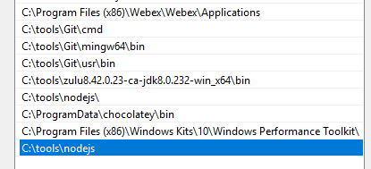

## 00: Overview

Benefit of using Typescript: 

* Optional type system 
    * Debatable: reduce runtime bugs if used correctly.
        ``` 
        interface Person {
            id: string;
            name: string;
        }

        function sayHello(person: Person) {
            console.log(person.name);
        }
        // don't do this!
        sayHello({} as any);
        ```

* Encourage developers to practice design-by-contracts.
    ``` 
    export function printPerson(person: Person) {
        console.log(`First name: ${person.firstName}, last name: ${person.lastName}, gender: ${person.gender}`);
    }

    export interface Person {
        firstName: string,
        lastName: string,
        gender: "female" | "male" | "other"
    }
    ```
* Tooling: Webstorm and VsCode seems to work better with Typescript
    * If used correctly, it's more refactoring friendly than JavaScript
    * If used correctly, it can provide accurate *Intellisense* (code auto-complete)

**NOTE**: Since Typescript is a superset of JavaScript, a strong primer of JavaScript is recommended. Most of the topics
in this knowledge sharing are actually core JavaScript concepts (especially related to ECMAScript 6 and above).

### Configuration

Dependencies: 

1. Ensure that Node.js is installed and added to the path environment variable.
    * for Windows:  
        * Download from [here](https://nodejs.org/en/download/)
        * Add Node.js binary directory to _Path_ environment variable: 
        * Add `NODE_PATH` environment variable to allow access to global `node_modules`. Usually it points to `node_modules` under npm, e.g. 
          `C:\Users\YOUR_HOME_DIRECTORY\AppData\Roaming\npm\node_modules`
        * Alternatively use chocolatey: `choco install nodejs`
    * for OSX/MacOS: 
        * Install [homebrew](https://docs.brew.sh/Installation)
        * `brew install node`
1. `npm install typescript` 
1. `npm install tslib`: to allow the use of `async-await` construct. 

Typescript has a community repository of types located at `http://definitelytyped.org/`. It's npm-scoped under `@types`. For example, if 
you want type definition for Node.js server development: `npm install --save @types/node`. 

`tsconfig.json`: configure the behavior of typscript compiler.
* the presence of this file indicates the root directory of a typescript project
* the configuration that I will used for this knowledge sharing: 
    ``` 
    {
      "compilerOptions": {
        "baseUrl": "./",
        "outDir": "./dist/", // compiled js will be located here
        "sourceMap": true, // for debugging purpose
        "declaration": false,
        "downlevelIteration": true,
        "experimentalDecorators": true,
        "module": "commonjs", // most of the example will be run in node, so use commonjs
        "moduleResolution": "node",
        "importHelpers": true,
        "allowJs": true, // also include javascript file if needed
        "target": "es2015",
        "typeRoots": [
          "./node_modules/@types" // location of type definition
        ],
        "types": [] // if you add custom types, add it here.
      },
      "include": [
        "**.ts",
        "**.tsx",
        "**.js"
      ],
      "compileOnSave": true, // auto rebuild
      "files": ["main.ts"] // entry point
    }
    ```
* For more [information](https://www.typescriptlang.org/docs/handbook/tsconfig-json.html).

## 01: Basic

### JavaScript scoping

**Important**: By default, variables in JavaScript are function scoped instead of block scoped. This rule still applies 
to Typescript.

``` 
var foo = 123;
if (true) {
    // In Java this won't even compile
    var foo = 456;
}
console.log(foo); 

if (true) {
    var bar = 789;
}
console.log(bar);
```

Typical issue with JavaScript scoping: 

``` 
var funcs = [];
// define a collection of functions
for (var i = 0; i < 3; i++) {
    funcs.push(function() {
        // i is from the global scope
        console.log(i);
    })
}
// call them
for (var j = 0; j < 3; j++) {
    funcs[j]();
}
```
* What's the expected result?

Compare the code above with: 

``` 
var funcs = [];
// define a collection of functions
for (var i = 0; i < 3; i++) {
    (function () {  // notice that there's additional layer of function here
        var local = i;
        funcs.push(function() {
            console.log(local);
        })
    })();
}
// call them
for (var j = 0; j < 3; j++) {
    funcs[j]();
}
```

### Variable declaration

`var` vs. `let` vs. `const`

* `var` function-scoped
* `let` block-scoped. (introduced in Ecmascript 6) 
    ``` 
    let foo = 123;
    if (true) {
        let foo = 456;
        console.log(foo);
    }
    console.log(foo);
    ```
* `const` block-scoped and final. (introduced in Ecmascript 6) 

### Looping

Besides the basic `for`, there 2 additional types of for loop: 

* `for...in`: Iterate based on enumerable properties. Basically it will iterate based on index.
    ``` 
    const letters = "ABC";
    // @ts-ignore - for demonstration purpose
    for (let value in letters) {
        console.log(value); // 0, 1, 2
    }
    ```
* `for...of`: Iterate based on iterable collections. Iterables collection is an object that have a `[Symbol.iterator]` 
  property. Example of iterables collection are array and string.
    ``` 
    const array = ['a', 'b', 'c'];
    for (let value of array) {
        // abc 
        console.log(value);  
    }
  
    let string = "banana"
    for (let value of string) {  
        // banana
        console.log(value);
    }
    ```
  
There's also `array.forEach` and `array.map` functions.

## 02: `this` Bindings

### Rule 1: Default Bindings

During standalone function invocation, `this` will bind to global object. 

try the following code in browser console:

```
var count = 1000;
function foo() {
    console.log(this.count);
    this.count++;
}
foo();
foo();
```
* The example above won't run in `strict mode`
* The example above won't run in Node.js. In Node.js, module will run inside a wrapper function (so there's no real 
  _global_ context). For more info:
    * [stackoverflow answer](https://stackoverflow.com/a/27032022)
    * [github](https://github.com/nodejs/node-v0.x-archive/blob/v0.10.33-release/src/node.js#L883-L885)
    
### Rule 2: Implicit Bindings

Bind to the owning object in the call site regardless of the function declaration.

``` 
function foo() {
    console.log(`a is: ${this.a}`);
}

var obj = {
    a: 2,
    foo: foo
};

obj.foo();
```

Potential bug caused by with implicit bindings: 

``` 
function foo() {
    console.log(`a is: ${this.a}`);
}

var obj = {
    a: 2,
    foo: foo
};

setTimeout(obj.foo, 100); // see Rule#1
```

### Rule 3: Explicit Bindings

2 approaches:
1. Create a new function which bind to the object explicitly: 
    ``` 
    function foo() {
        console.log(`a is: ${this.a}`);
    }

    const obj = {
        a: 2,
    };

    const bindFoo = foo.bind(obj);
    bindFoo(); // this will always refer to obj
    ```
1. Use `apply` to invoke a function:
    ``` 
   function foo() {
       console.log(`a is: ${this.a}`);
   }

   const obj = {
       a: 2,
   };
   
   foo.apply(obj) // a is: 2
   ```
   
### Rule 4: New Operator (Constructor Binding)

What `new` keyword really does: 
1. Creates a blank, plain JavaScript object;
1. Links (sets the constructor of) this object to another object;
1. Passes the newly created object from Step 1 as the `this` context;
1. Returns `this` if the function doesn't return its own object.

```
function Foo(a) {
    this.a = a;
}
const bar = new Foo( 2 );
console.log( bar.a ); // 2
```

### Arrow Function

Purpose of arrow function: 
* shorter form of anonymous function: 
   ``` 
  const sum = [1, 2, 3].reduce((prev, curr) => prev + curr);
  console.log(sum);
   ```
* Simplify the concept of `this`. An arrow function does not create/bind its own `this` context on the call site, so 
  `this` has the original meaning from the enclosing context during declaration. 
  
   1. Example below will throw error because `this` inside `setInterval` is not the same with `this` inside the `Person` 
      constructor (remember binding rule#1?).
       ``` 
       function Person() {
         this.age = 0;
         setInterval(function growUp() {
           this.age++;
         }, 1000);
       }

       var p = new Person();
       ```
    1. Before ECMAScript 6, _this_ can somewhat be fixed by capturing its value into different variable: 
       ``` 
       function Person() {
        var that = this; // remember in chapter 01 - variable is function scoped in JavaScript
        that.age = 0;
       
        setInterval(function growUp() {
          that.age++;
        }, 1000);
       }
       
       var p = new Person();
       ```
    1. In ECMAScript 6, we can use arrow function to achieve the same thing: 
       ``` 
       function Person() {
           this.age = 0;
           setInterval(() => {
             this.age++;
           }, 1000);
       }
       const p = new Person();
       ```

## 03: Object, Classes, Interfaces

### Classes

TODO

### Interfaces

TODO

### Object Literal

TODO: don't forget spread operator

## 04: Asynchronous programming: Promise, Generators, Async-await 

### JavaScript Event Loop

By default, a JavaScript runtime (including Node.JS and web browser) has these properties: 

* 1 process
* 1 thread
* One event loop per thread

TODO: expand more

### Promise

Promise was added in ECMAScript 6 to simplify callback-style asynchronous programming. 

Before promise: 

``` 
import * as fs from "fs";

function loadJSON(filename: string, callback: (error: Error, result?: any) => void) {
    fs.readFile(filename, function (err, data) {
        if (err) {
            return callback(err);
        }
        try {
            // Rule 03: Contain all your sync code in a try catch
            var parsed = JSON.parse(data.toString());
        }
        catch (err) {
            // Rule 02: never throw error, it should be handled by callback
            return callback(err);
        }
        // except when you call the callback
        return callback(null, parsed);
    });
}

// usage:
loadJSONCallback("./sample.json", (error, result) => {
    if (error) {
        console.log(`Callback: Error happened: ${error}`);
    } else {
        console.log(`Callback: JSON content for hello property is: ${result.hello}`);
    }
});
```
**NOTE**: in order to maintain correctness when writing callback,  some rules need to be followed.
1. Never call the callback twice
1. Never throw error
1. Contain all your sync code in a try catch, except when you call the callback.

With promise, you can simplify the code further while still maintaining correctness: 

``` 
// fs has a promise-based variant
import {promises as fs} from "fs";

export function loadJsonPromise(filename: string): Promise<any> {
    return fs.readFile(filename) // we are using promise variant of fs
        .then(data => JSON.parse(data.toString()))
}

// usage:
loadJsonPromise("./sample.json")
    .then(jsonData => console.log(`Promise: JSON content for hello property is: ${jsonData.hello}`)) // on success
    .catch(error => console.log(`Promise: Error happened: ${error}`)); // on error
```

### Generators

TODO:

### Async-await

TODO:


## 05: 3rd Party Libraries

### RxJS

TODO: 

### Angular

TODO:

### NgRx

TODO: 

### Jest

TODO: 
